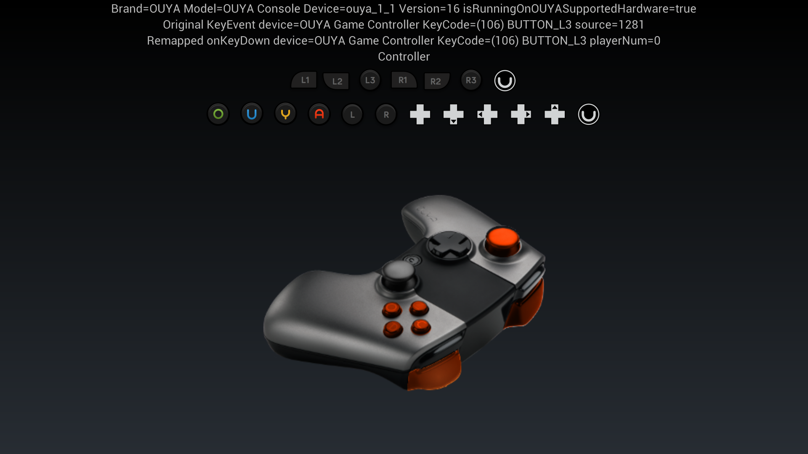
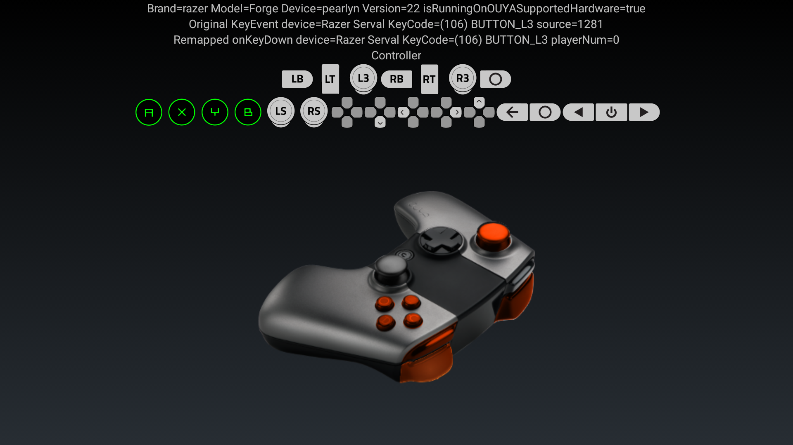
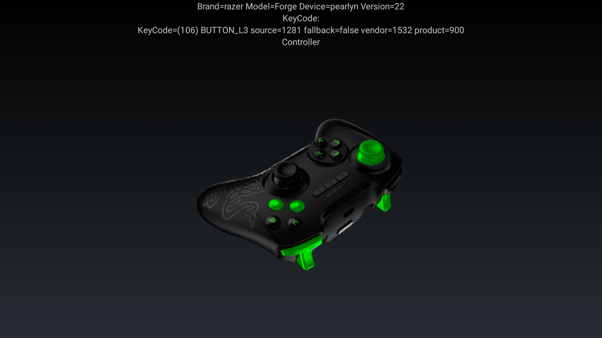

# Java Engine

* The [RazerSDK](https://github.com/razerofficial/razer-sdk-docs) can be accessed via the `store-sdk-standard-release.aar` Android Library.

### Forums

[Forge TV on Razer Forums](https://insider.razerzone.com/index.php?forums/razer-forge-tv.126/)

# Audience

This document is for developers that uses Java to make apps for Android. The docs target developers using Android Studio, Eclipse, or IntelliJ. However, most engines also have a Java hook that will be able to reuse the samples.

## Releases

Java apps/games use the `store-sdk-standard-release.aar` library included in the `RazerSDK` downloadable from the [Cortex developer portal](http://devs.ouya.tv).

# Java Samples

## Virtual Controller Sample

The virtual controller sample uses OUYA-Everywhere input. The button names and images are accessible from the API. And the virtual controller buttons highlight with multiple controllers for supported controllers. TextViews display the incoming keycode values and the remapped keycodes after the `InputMapper` has remapped the input.

The [VirtualController](https://github.com/razerofficial/java-razer-sdk/tree/master/Samples/virtual-controller) sample is an `Android Studio` project.



The `VirtualController` example uses the `Controller.getButtonData` API to display device specific controller images.



## Android Virtual Controller Project 

The project has a small number of key files that makes the example work.

### AndroidManifest.xml

The intent-filter specifies categories for the `leanback launcher` and `Razer` store. Apps use the category `com.razerzone.store.category.APP`. Games use the category `com.razerzone.store.category.GAME`.

```
            <intent-filter>
                <action android:name="android.intent.action.MAIN" />
                <category android:name="android.intent.category.LAUNCHER" />
                <category android:name="android.intent.category.LEANBACK_LAUNCHER" />
                <category android:name="com.razerzone.store.category.APP" />
            </intent-filter>
```

### MainActivity.java

The starting and only activity in the project responsible for the logic to display text, buttons, and toggle image visibility based on input.

### DebugInput.java

A debug class for displaying keycode and axis value input in human-readable format in the logcat.

### store-sdk-standard-release.aar

The `store-sdk-standard-release.aar` Java library released through the developer portal which provides access to the `RazerSDK`.

### activity_main.xml

The Android layout that specifies the position and content that displays text and images.

### drawables

The drawable resources hold the icons and controller images used in the example.

### Example Code

#### MainActivity

The MainActivity extends the `BaseActivity` from the `store-sdk-standard-release.aar` for the easiest way to add OUYA-Everywhere input.

```
public class MainActivity extends BaseActivity {
```

#### setDrawable

Accepts the ImageView that will display the button image and the keyCode id for the corresponding button image.

```
	private void setDrawable(ImageView imageView, int keyCode) {
		ButtonData data = Controller.getButtonData(keyCode);
		if (null != data) {
			imageView.setImageDrawable(data.buttonDrawable);
		}
	}
```

#### bitmap

The `ButtonData` image can also be converted to a `Bitmap` which can be used in other cases. 

```
    private Bitmap getButtonDataBitmap(int button) {
    	Controller.ButtonData buttonData = Controller.getButtonData(button);
        if (null == buttonData)
        {
            return null;
        }
        BitmapDrawable drawable = (BitmapDrawable)buttonData.buttonDrawable;
        if (null == drawable)
        {
            return null;
        }
        Bitmap bitmap = drawable.getBitmap();
        return bitmap;
    }
```

#### onCreate

Loads the layout and gets the references to the ImageView controls that will handle toggling button visibility when toggled.

```
	@Override
	protected void onCreate(Bundle savedInstanceState) {
		
		setContentView(R.layout.activity_main);
		super.onCreate(savedInstanceState);
		
		mTxtSystem = (TextView)findViewById(R.id.txtSystem);
		mTxtController = (TextView)findViewById(R.id.txtController);
		mImgButtonMenu = (ImageView)findViewById(R.id.imgButtonMenu);
		mTxtKeyCode = (TextView)findViewById(R.id.txtKeyCode);
		mImgControllerO = (ImageView)findViewById(R.id.imgControllerO);
		mImgControllerU = (ImageView)findViewById(R.id.imgControllerU);
		mImgControllerY = (ImageView)findViewById(R.id.imgControllerY);
		mImgControllerA = (ImageView)findViewById(R.id.imgControllerA);
		mImgControllerL1 = (ImageView)findViewById(R.id.imgControllerL1);
		mImgControllerL2 = (ImageView)findViewById(R.id.imgControllerL2);
		mImgControllerL3 = (ImageView)findViewById(R.id.imgControllerl3);
		mImgControllerR1 = (ImageView)findViewById(R.id.imgControllerR1);
		mImgControllerR2 = (ImageView)findViewById(R.id.imgControllerR2);
		mImgControllerR3 = (ImageView)findViewById(R.id.imgControllerR3);
		mImgControllerDpadDown = (ImageView)findViewById(R.id.imgControllerDpadDown);
		mImgControllerDpadLeft = (ImageView)findViewById(R.id.imgControllerDpadLeft);
		mImgControllerDpadRight = (ImageView)findViewById(R.id.imgControllerDpadRight);
		mImgControllerDpadUp = (ImageView)findViewById(R.id.imgControllerDpadUp);
		mImgControllerMenu = (ImageView)findViewById(R.id.imgControllerMenu);
		mImgButtonA = (ImageView)findViewById(R.id.imgButtonA);
		mImgDpadDown = (ImageView)findViewById(R.id.imgDpadDown);
		mImgDpadLeft = (ImageView)findViewById(R.id.imgDpadLeft);
		mImgDpadRight = (ImageView)findViewById(R.id.imgDpadRight);
		mImgDpadUp = (ImageView)findViewById(R.id.imgDpadUp);
		mImgLeftStick = (ImageView)findViewById(R.id.imgLeftStick);
		mImgLeftBumper = (ImageView)findViewById(R.id.imgLeftBumper);
		mImgLeftTrigger = (ImageView)findViewById(R.id.imgLeftTrigger);
		mImgButtonO = (ImageView)findViewById(R.id.imgButtonO);
		mImgRightStick = (ImageView)findViewById(R.id.imgRightStick);
		mImgRightBumper = (ImageView)findViewById(R.id.imgRightBumper);
		mImgRightTrigger = (ImageView)findViewById(R.id.imgRightTrigger);
		mImgLeftThumb = (ImageView)findViewById(R.id.imgLeftThumb);
		mImgRightThumb = (ImageView)findViewById(R.id.imgRightThumb);
		mImgButtonU = (ImageView)findViewById(R.id.imgButtonU);
		mImgButtonY = (ImageView)findViewById(R.id.imgButtonY);
```

Input can be event based, or spawn a thread to set visibility on an interval. The menu button is pressed and the visibility needs to be cleared after an interval rather than waiting for an event to clear it.

```
    	// spawn thread to toggle menu button
        Thread timer = new Thread()
        {
	        public void run()
	        {
	        	while (mWaitToExit)
	        	{
	        		if (mMenuDetected != 0 &&
	        			mMenuDetected < System.nanoTime())
	        		{
	        			mMenuDetected = 0;
	        			Runnable runnable = new Runnable()
	        			{
		        			public void run()
		        			{
		        				mImgButtonMenu.setVisibility(View.INVISIBLE);
		        			}
	        			};
	        			runOnUiThread(runnable);
	        			
	        		}
	        		try
	        		{
	        			Thread.sleep(50);
	        		}
	        		catch (InterruptedException e)
	        		{
	        		}
		        }
			}
        };
		timer.start();
```
 

#### onStart

Initialization displays build information and sets the drawable button images from the new api.

```
	@Override
	protected void onStart() {
		super.onStart();
		txtSystem.setText("Brand=" + android.os.Build.BRAND + " Model=" + android.os.Build.MODEL + " Version=" + android.os.Build.VERSION.SDK_INT);
		
		setDrawable(mImgControllerO, Controller.BUTTON_O);
		setDrawable(mImgControllerU, Controller.BUTTON_U);
		setDrawable(mImgControllerY, Controller.BUTTON_Y);
		setDrawable(mImgControllerA, Controller.BUTTON_A);
		setDrawable(mImgControllerL1, Controller.BUTTON_L1);
		setDrawable(mImgControllerL2, Controller.BUTTON_L2);
		setDrawable(mImgControllerL3, Controller.BUTTON_L3);
		setDrawable(mImgControllerR1, Controller.BUTTON_R1);
		setDrawable(mImgControllerR2, Controller.BUTTON_R2);
		setDrawable(mImgControllerR3, Controller.BUTTON_R3);
		setDrawable(mImgControllerDpadDown, Controller.BUTTON_DPAD_DOWN);
		setDrawable(mImgControllerDpadLeft, Controller.BUTTON_DPAD_LEFT);
		setDrawable(mImgControllerDpadRight, Controller.BUTTON_DPAD_RIGHT);
		setDrawable(mImgControllerDpadUp, Controller.BUTTON_DPAD_UP);
		setDrawable(mImgControllerMenu, Controller.BUTTON_MENU);
	}
```

#### onGenericMotionEvent

The axis events arrive with onGenericMotionEvent after the OUYA-Everywhere has remapped the input.

```
	@Override
	public boolean onGenericMotionEvent(MotionEvent motionEvent) {
		float lsX = motionEvent.getAxisValue(Controller.AXIS_LS_X);
	    float lsY = motionEvent.getAxisValue(Controller.AXIS_LS_Y);
	    float rsX = motionEvent.getAxisValue(Controller.AXIS_RS_X);
	    float rsY = motionEvent.getAxisValue(Controller.AXIS_RS_Y);
	    float l2 = motionEvent.getAxisValue(Controller.AXIS_L2);
	    float r2 = motionEvent.getAxisValue(Controller.AXIS_R2);
```

#### onKeyDown

When a button is pressed the corresponding image is highlighted. When the system button is detected, the image is highlighted for an interval.

```
	@Override
	public boolean onKeyDown(int keyCode, KeyEvent keyEvent) {
		switch (keyCode)
		{
		case Controller.BUTTON_L1:
			mImgLeftBumper.setVisibility(View.VISIBLE);
			return true;
		case Controller.BUTTON_L3:
			mImgLeftStick.setVisibility(View.INVISIBLE);
			mImgLeftThumb.setVisibility(View.VISIBLE);
			return true;
		case Controller.BUTTON_R1:
			mImgRightBumper.setVisibility(View.VISIBLE);
			return true;
		case Controller.BUTTON_R3:
			mImgRightStick.setVisibility(View.INVISIBLE);
			mImgRightThumb.setVisibility(View.VISIBLE);
			return true;
		case Controller.BUTTON_O:
			mImgButtonO.setVisibility(View.VISIBLE);
			return true;
		case Controller.BUTTON_U:
			mImgButtonU.setVisibility(View.VISIBLE);
			return true;
		case Controller.BUTTON_Y:
			mImgButtonY.setVisibility(View.VISIBLE);
			return true;
		case Controller.BUTTON_A:
			mImgButtonA.setVisibility(View.VISIBLE);
			return true;
		case Controller.BUTTON_DPAD_DOWN:
			mImgDpadDown.setVisibility(View.VISIBLE);
			return true;
		case Controller.BUTTON_DPAD_LEFT:
			mImgDpadLeft.setVisibility(View.VISIBLE);
			return true;
		case Controller.BUTTON_DPAD_RIGHT:
			mImgDpadRight.setVisibility(View.VISIBLE);
			return true;
		case Controller.BUTTON_DPAD_UP:
			mImgDpadUp.setVisibility(View.VISIBLE);
			return true;
		case Controller.BUTTON_MENU:
			mImgButtonMenu.setVisibility(View.VISIBLE);
			mMenuDetected = System.nanoTime() + 1000000000;
			return true;
		}
		return true;
	}
```

#### onKeyUp

When the button is no longer pressed the ImageView for the highlighted button is hidden.

```
	@Override
	public boolean onKeyUp(int keyCode, KeyEvent keyEvent) {
		switch (keyCode)
		{
		case Controller.BUTTON_L1:
			mImgLeftBumper.setVisibility(View.INVISIBLE);
			return true;
		case Controller.BUTTON_L3:
			mImgLeftStick.setVisibility(View.VISIBLE);
			mImgLeftThumb.setVisibility(View.INVISIBLE);
			return true;
		case Controller.BUTTON_R1:
			mImgRightBumper.setVisibility(View.INVISIBLE);
			return true;
		case Controller.BUTTON_R3:
			mImgRightStick.setVisibility(View.VISIBLE);
			mImgRightThumb.setVisibility(View.INVISIBLE);
			return true;
		case Controller.BUTTON_O:
			mImgButtonO.setVisibility(View.INVISIBLE);
			return true;
		case Controller.BUTTON_U:
			mImgButtonU.setVisibility(View.INVISIBLE);
			return true;
		case Controller.BUTTON_Y:
			mImgButtonY.setVisibility(View.INVISIBLE);
			return true;
		case Controller.BUTTON_A:
			mImgButtonA.setVisibility(View.INVISIBLE);
			return true;
		case Controller.BUTTON_DPAD_DOWN:
			mImgDpadDown.setVisibility(View.INVISIBLE);
			return true;
		case Controller.BUTTON_DPAD_LEFT:
			mImgDpadLeft.setVisibility(View.INVISIBLE);
			return true;
		case Controller.BUTTON_DPAD_RIGHT:
			mImgDpadRight.setVisibility(View.INVISIBLE);
			return true;
		case Controller.BUTTON_DPAD_UP:
			mImgDpadUp.setVisibility(View.INVISIBLE);
			return true;
		case Controller.BUTTON_MENU:
			//wait 1 second
			return true;
		}
		return true;
	}
```

## Serval Virtual Controller Sample

The `ServalVirtualController` sample includes virtual controller images and mappings for the Razer Serval Controller. The [serval-virtual-controller](https://github.com/razerofficial/java-razer-sdk/tree/master/Samples/serval-virtual-controller) sample is an `Android Studio` project.



## In-App-Purchases Sample

The [In-App-Purchase](https://github.com/razerofficial/java-razer-sdk/tree/master/Samples/iap-sample-app) sample is an `Android Studio` project.

## StoreFacade

The `StoreFacade` has several listeners for `in-app-purchase` callbacks.

```
public class CustomActivity extends Activity
{
	// The tag for log messages
	private static final String TAG = ActivityCommon.class.getSimpleName();

	// Toggle debug logging
	private static final boolean sEnableLogging = false; 

	// Your game talks to the StoreFacade, which hides all the mechanics of doing an in-app purchase.
	private StoreFacade mStoreFacade = null;
	
	// listener for init complete
	private ResponseListener<Bundle> mInitCompleteListener = null;

	// listener for fetching gamer info
	private ResponseListener<GamerInfo> mRequestGamerInfoListener = null;

	// listener for getting products
	private ResponseListener<List<Product>> mRequestProductsListener = null;

	// listener for requesting purchase
	private ResponseListener<PurchaseResult> mRequestPurchaseListener = null;

	// listener for getting receipts
	private ResponseListener<Collection<Receipt>> mRequestReceiptsListener = null;

    // listener for shutdown
    private CancelIgnoringResponseListener mShutdownListener = null;
}
```

### Secret API Key

Each game entry in the [developer portal](https://devs.ouya.tv) has a `Secret API Key` used for store encryption/decryption. The `Secret API Key` for each game can be found in the `Games` section of the developer portal.

```
	private static final String SECRET_API_KEY =
	  "eyJkZXZlbG9wZXJfaWQiOiIzMTBhOGY1MS00ZDZlLTRhZTUtYmRhMC1iOTM4" +
	  "NzhlNWY1ZDAiLCJkZXZlbG9wZXJfcHVibGljX2tleSI6Ik1JR2ZNQTBHQ1Nx" +
	  "R1NJYjNEUUVCQVFVQUE0R05BRENCaVFLQmdRQy9wTTE2MHBWekw4ZG1yNVRq" +
	  "aGZCVS95NjluQVl3TytJTXI3c2tCNFNJSXc1emFpWTNKWE5YMmpESXlRdzVK" +
	  "U0VBYnBaa1JYa0d6YTVGTFArU2MyUktISUVJdVF1bnQ3R1MrU3FPcU5mQXRY" +
	  "d2c3N3lSWU5rTXBvdFpFU0x4d05HVnFjN1g1SHdLdzRKcHJ2aXhZbGFkd0hW" +
	  "dTUwUTc1WHlNQlBWVlF0SFpOd0lEQVFBQiJ9"; 
```

The `StoreFacade` can use the `Secret API Key` and create the `Bundle` used for initialization.

```
		Bundle developerInfo = null;
		try {
			developerInfo = StoreFacade.createInitBundle(SECRET_API_KEY);
		} catch (InvalidParameterException e) {
			Log.e(TAG, e.getMessage());
			abort();
			return;
		}

		if (sEnableLogging) {
			Log.d(TAG, "developer_id=" + developerInfo.getString(StoreFacade.DEVELOPER_ID));
		}

		if (sEnableLogging) {
			Log.d(TAG, "developer_public_key length=" + developerInfo.getByteArray(StoreFacade.DEVELOPER_PUBLIC_KEY).length);
		}
```

Implement the listeners to pass to the `StoreFacade` IAP methods.

```
		mInitCompleteListener = new ResponseListener<Bundle>() {
			@Override
			public void onSuccess(Bundle bundle) {
				Log.d(TAG, "InitCompleteListener onSuccess");
			}

			@Override
			public void onFailure(int i, String s, Bundle bundle) {
				Log.e(TAG, "InitCompleteListener onFailure");
			}

			@Override
			public void onCancel() {
				Log.e(TAG, "InitCompleteListener onCancel");
			}
		};

		mRequestGamerInfoListener = new ResponseListener<GamerInfo>() {
            @Override
            public void onSuccess(GamerInfo info) {
            	Log.d(TAG, "RequestGamerInfoListener: onSuccess");
            }

            @Override
            public void onFailure(int errorCode, String errorMessage, Bundle optionalData) {
            	Log.d(TAG, "RequestGamerInfoListener: onFailure errorCode="+errorCode+" errorMessage="+errorMessage);
            }

			@Override
			public void onCancel() {
				Log.e(TAG, "RequestGamerInfoListener onCancel");
			}
        };
        
		mRequestProductsListener = new ResponseListener<List<Product>>() {
			@Override
			public void onSuccess(final List<Product> products) {
				Log.d(TAG, "RequestProductsListener: onSuccess received "+products.size()+" products");
			}

			@Override
			public void onFailure(int errorCode, String errorMessage, Bundle optionalData) {
				Log.d(TAG, "sRequestProductsListener: onFailure errorCode="+errorCode+" errorMessage="+errorMessage);
			}
		};

		mRequestPurchaseListener = new ResponseListener<PurchaseResult>() {

			@Override
			public void onSuccess(PurchaseResult result) {
				Log.d(TAG, "RequestPurchaseListener: onSuccess");
			}

			@Override
			public void onFailure(int errorCode, String errorMessage, Bundle optionalData) {
				Log.d(TAG, "RequestPurchaseListener: onFailure errorCode="+errorCode+" errorMessage="+errorMessage);
			}

			@Override
			public void onCancel() {
				Log.d(TAG, "RequestPurchaseListener: onCancel");
			}
		};
		
		mRequestReceiptsListener = new ResponseListener<Collection<Receipt>>() {

			@Override
			public void onSuccess(Collection<Receipt> receipts) {
				Log.d(TAG, "RequestReceiptsListener: onSuccess received "+receipts.size() + " receipts");
			}

			@Override
			public void onFailure(int errorCode, String errorMessage, Bundle optionalData) {
				Log.d(TAG, "RequestReceiptsListener: onFailure: errorCode="+errorCode+" errorMessage="+errorMessage);
			}

			@Override
			public void onCancel() {
				Log.d(TAG, "RequestReceiptsListener: onCancel");
			}
		};

        mShutdownListener = new CancelIgnoringResponseListener() {
            @Override
            public void onSuccess(Object o) {
                Log.d(TAG, "ShutdownListener onSuccess");

				// Wait for the shutdown success event before closing the application
				finish();
            }

            @Override
            public void onFailure(int errorCode, String message, Bundle bundle) {
                Log.e(TAG, "ShutdownListener onFailure failed to shutdown! errorCode="+errorCode+" message="+message);
            }
        };
```

## More

* Be sure to check out the [in-app-purchasing](https://github.com/ouya/docs/blob/razer-sdk/purchasing.md#in-app-purchasing) document for additional `IAP` details.
